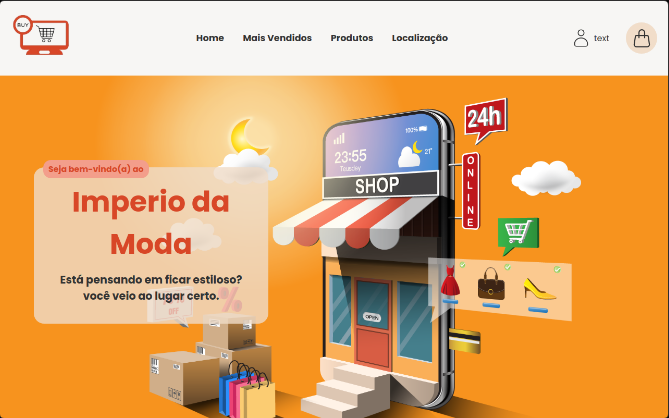

# E-commerce

## 🔥 Introdução

Este projeto apresenta o desenvolvimento de um e-commerce de roupas, com funcionalidades que visam proporcionar uma experiência satisfatória para os clientes.

Sobre a aplicação:

- Design Responsivo
- Carrossel de produtos
- Busca e filtragem de produtos
- página das roupas selecionadas
- Login e Cadastro de usuários
- Página somente para os ADM
- FAQ das perguntas frequentes

### ⚙️ Pré-requisitos

Para você conseguir instalar o projeto na sua máquina, verifique se você tem as seguintes tecnologias:

- node
- git

### 🔨 Guia de instalação

Etapas para instalar:

Passo 1:

```
git clone https://github.com/Darlan0307/ProjetoInter-2024.1.git
```

Passo 2:

```
cd e-commerce/frontend
```

Passo 3:

```
npm install ou yarn install ou pnpm install
```

Passo 4:

```
npm run dev ou yarn start ou pnpm dev
```

## 📦 Tecnologias usadas:

**Front-end:**

- 
- 
- 
- 

  **Back-end:**

- 
- 
- 
- 
- 
- 
- 

## 💡 Social

- Link para o seu linkedin [Meu linkedin](https://www.linkedin.com/in/darlan-martins-8a7956259/)
